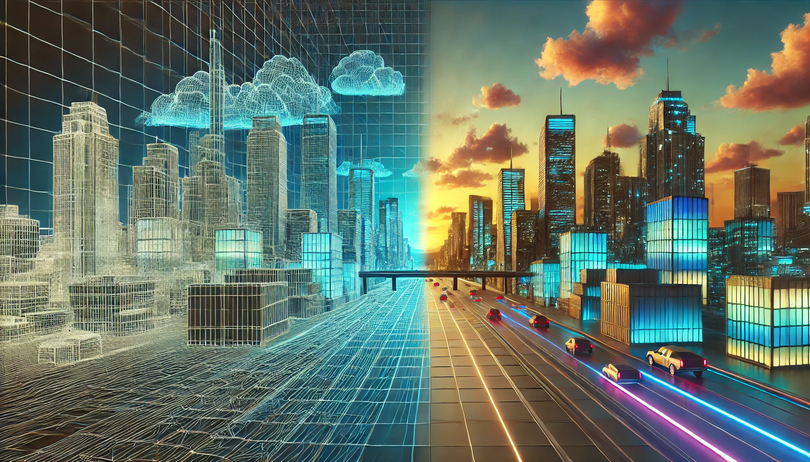

# The Evolution of 3D Graphics Rendering: From Wireframes to Physically-Based Rendering

3D Cityscape Visualisation - OpenAI [[23]](#ref23)

## Introduction

Ever since computer graphics where first introduced around the 1960s, 3D rendering has constantly been evolving overtime from simple wireframe models to photorealistic enviroments that are nearly identical to reality. This evolution doesn't just represent the technological advancements made but also the growing understanding of how light interacts with materials in the physical world. This report examines the historical progression of 3D graphics rendering techniques exploring five major phases that have defined computer graphics: vector graphics, flat shading with textures, environmental effects, advanced lighting, and physically-based rendering.

## Phase 1: Vector Graphics (1960s-1970s)

The earliest form of 3D computer graphics consisted of simple wireframe models which can be described as skeletal representations of models that display only the edges of objects using lines connecting vertices in a 3D space. This approach was first seen during the 1960s when computing power was extremely limited and hardware constraints made more complex rendering impossible.

Ivan Sutherland's Sketchpad system which was developed at MIT in 1963 is considered the first computer graphics program that allowed users to create and manipulate wireframe objects in 3D [[1]](#ref1). Early wireframe graphics were normally monochromatic which is seen with the use of bright green lines on black background to represent the 3D model. 

The advantages of wireframe rendering was it's computational efficiency and speed when it came to generating renders. This is because there was no need to calculate complex lighting or surface properties which allowed computers to render and manipulate 3D models in real-time even though there was significant constraints on processing power at the time. This made wireframe graphics very popular for early CAD (Computer-Aided Design) applications, flight simulators and the first 3D video games like Battlezone (1980) [[2]](#ref2).

Regardless of it's simplicity, wireframe models faced significant limitations such as the *"hidden line problem."* Using wireframes required that all edges were visible regardless of their position relative to the camera and this often made it difficult to determine which parts of an object were in front or behind. The development of hidden-line removal algorithms by L. G. Roberts in 1963 [[3]](#ref3) updated by A. Appel in 1968 [[4]](#ref4) did aim to solve this issue and allowed for better rendering of 3D wireframes as time progressed.

## Phase 2: Flat Shading with Textures (1970s-1980s)

The transition from wireframe models to solid objects signified a major improvment in 3D graphics and the potential it had. Flat shading which was developed in the 1970s assigns a single uniform color to each polygon face in a 3D model based on its orientation to a light source. This technique helped to give objects a solid appearance and created a more recognizable representation of the 3D model it was trying to visualize.

Flat shading implements the simplest form of the illumination model developed by Bui Tuong Phong in 1973. It's major limitation in the early model was how it calculated light by only working out luminance once per polygon rather than per pixel which was later added in 1975 [[5]](#ref5). It worked by determining the light intensity for each face by the angle between the face and the direction of the light source.

The introduction of textures in the late 1970s and early 1980s transformed 3D graphics as it allowed more detailed images to be mapped onto these flat-shaded surfaces. This innovation was pioneered by Edwin Catmull in 1974 [[6]](#ref6) and added visual detail without increasing geometric complexity, ensuring that it wouldn't be overly complex to render each scene. Early texture mapping was computationally expensive meaning that it was limited to running on high-end systems but by the mid-1980s it was more widely accessible due to improvments on proccessing power.

The combination of flat shading and textures helped to create the visual style of early 3D games like Doom (1993) which used flat-shaded polygons with texture mapping to create 3D environments that could run on less powerful machines. As explained by Abrash [[7]](#ref7), id Software's approach to texture mapping revolutionized real-time 3D graphics for consumer hardware. Whilst it's very outdated by today's standards, this approach represented the advancements being made in creating engaging virtual worlds.

## Phase 3: Environmental Effects and Skyboxes (1990s)

During the 1990's computer graphics where significantly improving and focus turned to creating immersive environments by implementing atmospheric effects and infinite backgrounds. This period saw the introduction of skyboxes which are cube maps that surround the entire scene with distant imagery to create the illusion of an expansive world beyond the playable area.

Skyboxes where first seen in early games like Quake (1996) and solved the problem of limited draw distance and empty backgrounds by projecting images onto the inside faces of a cube surrounding the viewpoint as explained by Abrash [[7]](#ref7). This technique efficiently created the impression of vast landscapes/cityscapes without requiring extensive geometry to render these background scenes.

Furthermore, environmental effects such as fog, rain, and reflections was also developed to add more realism to 3D scenes. Distance fog, which was implemented in games such as Silent Hill (1999), not only created atmosphere but also helped to hide technical limitations by obscuring distant objects that would otherwise pop into view as they entered the rendering distance. Techniques for atmospheric scattering were formalized by Nishita et al. [[8]](#ref8), enabling more realistic rendering of outdoor environments with proper sky coloration.

The introduction of environmental mapping (reflection mapping) developed by Blinn and Newell in 1976 [[9]](#ref9) began to see widespread adoption in the 1990s as it allowed surfaces to reflect their surroundings. This technique was very effective for materials like water, glass, and polished metal as it further enchanced the realism of 3D scenes. Greene [[10]](#ref10) later extended this work with more efficient environment mapping techniques.

Lastly, weather effects like rain added dynamism to otherwise static environments. Whislt early implementations of this effect were often simple particle systems, overtime they significantly enhanced immersion by making virtual worlds feel more alive and responsive with a good example of this being used in games like Metal Gear Solid (1998). Reeves [[11]](#ref11) provided the foundational particle system techniques that made these effects possible.

## Phase 4: Advanced Lighting Models (Mid-1990s to 2000s)

During the late 90s, 3D graphics saw the introduction of sophisticated lighting models that more accurately simulated how light interacts with different materials. The Phong and Blinn-Phong illumination models became industry standards during this period by calculating ambient, diffuse, and specular light components separately to create more realistic surface appearances.

The Phong illumination model which was developed by Bui Tuong Phong in 1975 [[5]](#ref5), calculated lighting at each pixel rather than each polygon which resulted in smoother highlights across curved surfaces. Following this, Jim Blinn's modified the Blinn-Phong model [[12]](#ref12) to further improve performance while maintaining visual quality which was achieved using the halfway vector method between the view and light directions, making it the preferred choice for real-time 3D applications.

Also seen during this time was the development of more advanced techniques like bump mapping which was designed by Blinn in 1978 [[13]](#ref13) and simulated surface details without adding geometric complexity by altering surface normals. Normal mapping extended this concept by storing normal information in texture maps and allowed for more detailed surfaces when rendering textures. Krishnamurthy and Levoy [[14]](#ref14) further refined these techniques with their work on normal maps.

Multiple light sources with different properties (point lights, spotlights, and directional lights) also became industry standards during this time as it enabled more complex lighting scenarios. The concept of dynamic shadows which was once computivaley intensive to render, began to appear in high-end applications and further enchanced realism by grounding objects in their environment. Williams' shadow mapping technique [[15]](#ref15) became widely adopted, while Crow's shadow volume approach [[16]](#ref16) provided an alternative method.

The combination of these techniques created a significant leap in visual quality of graphics, helping to enable games like Half-Life 2 (2004) and Doom 3 (2004) to create atmospheric environments with dramatic lighting that contributed substantially to the players immersion in virtual worlds. Mitchell [[17]](#ref17) documented how id Software's Doom 3 engine represented a significant advancement in real-time lighting and shadow techniques.

## Phase 5: Physically-Based Rendering (2010s to Present)

The current state-of-the-art in 3D graphics is physically-based rendering (PBR) which first emerged in the 2010s as the gold standard for realistic graphics. Unlike previous approaches that used artistic approximations, PBR aimed to simulate the actual physical properties of materials and light based on principles of physics and real-world measurements.

PBR is effective in creating realism by ensuring that surfaces don't reflect more light than they receive and the microfacet theory which consists of modeling surfaces as collections of tiny mirrors to achieve physically accurate results explained in a paper by Burley & Studios [[18]](#ref18). The key material parameters in PBR include:

- **Base color/albedo**: The color of a surface without lighting effects
- **Metalness**: Determining whether a surface behaves like a metal or non-metal
- **Roughness**: Controlling how diffuse or focused specular reflections are
- **Subsurface scattering**: Simulating how light penetrates and scatters within translucent materials

The adoption of High Dynamic Range (HDR) rendering and Image-Based Lighting (IBL) further enhanced PBR by providing realistic environmental illumination. HDR allows for a much wider range of brightness values than traditional 8-bit per channel rendering which helps enable effects like bloom and tone mapping to simulate how the human eye would see these enviroments in the real world. Reinhard et al. [[19]](#ref19) pioneered tone mapping operators that became essential for HDR rendering, while Debevec [[20]](#ref20) demonstrated the power of image-based lighting.

Real-time global illumination techniques is another method whilst still in it's early stages, has begun to accurately simulate indirect lighting which is how light interacts when it bounces off surfaces before reaching the viewer. Technologies like NVIDIA's RTX ray tracing have brought previously offline rendering techniques into real-time applications enabiling the possibilities of 3D graphics. Kajiya's rendering equation [[21]](#ref21) formalized the mathematical foundation for these global illumination techniques.

The PBR approach has been widely adopted throughout the industry, from films like Disney's Frozen (2013) to games like Uncharted 4 (2016) and architectural visualization software. Its physics-based foundation ensures consistent results across different lighting conditions and makes it ideal for creating realisitic virtual worlds. Karis [[22]](#ref22) documented the implementation of PBR in Epic's Unreal Engine 4, which became one of the most influential real-time PBR systems.

## Conclusion

The evolution of 3D graphics rendering from simple wireframes to physically-based rendering represents one of the most dramatic technological progressions in computing history. Each development was built upon the foundations of models by it's predecessors and innovated from addressing limitations and pushing the boundaries of what was visually possible.

This journey reflects not just advancements in technology but also our deepening understanding of how light and materials interact in the physical world. As computing power continues to increase and new techniques emerge, the line between virtual and real continues to blur but opens new possibilities for artistic expression, simulation, and human-computer interaction.

Today's real-time rendering capabilities would have seemed like science fiction even 10 years ago, yet they rely on the innovation of graphics since the idea was formed nearly half a century ago. The green wireframe aesthetics of the 1960s remain just as important to the history of computer graphics as the photorealistic rendering of today as each progression represents a crucial step in the 3D graphic designers goal to reimagine our world through digital means.

## References

[1] Sutherland, I. E. (1963). [*Sketchpad: A man-machine graphical communication system*](https://www.cl.cam.ac.uk/techreports/UCAM-CL-TR-574.pdf) (Doctoral dissertation, Massachusetts Institute of Technology). https://doi.org/10.1145/1461551.1461591

[2] Dahl, O. (1998). The birth of Battlezone. *Game Developer Magazine*, 5(8), 28-42.

[3] Roberts, L. G. (1963). [*Machine perception of three-dimensional solids*](https://www.packet.cc/files/mach-per-3D-solids.html) (Doctoral dissertation, Massachusetts Institute of Technology). Technical Report No. 315, Lincoln Laboratory.

[4] Appel, A. (1968). Some techniques for shading machine renderings of solids. *Proceedings of the Spring Joint Computer Conference*, 37-45. https://doi.org/10.1145/1468075.1468082

[5] Phong, B. T. (1975). Illumination for computer generated pictures. *Communications of the ACM*, 18(6), 311-317. https://doi.org/10.1145/360825.360839

[6] Catmull, E. (1974). [*A subdivision algorithm for computer display of curved surfaces*](https://www.cs.utah.edu/~dejohnso/dialogues/catmull/) (Doctoral dissertation, University of Utah). Technical Report UTEC-CSc-74-133.

[7] Abrash, M. (1997). *Michael Abrash's Graphics Programming Black Book*. Coriolis Group Books. ISBN: 1-57610-174-6

[8] Nishita, T., Sirai, T., Tadamura, K., & Nakamae, E. (1993). Display of the earth taking into account atmospheric scattering. *Proceedings of SIGGRAPH '93*, 175-182. https://doi.org/10.1145/166117.166140

[9] Blinn, J. F., & Newell, M. E. (1976). Texture and reflection in computer generated images. *Communications of the ACM*, 19(10), 542-547. https://doi.org/10.1145/360349.360353

[10] Greene, N. (1986). Environment mapping and other applications of world projections. *IEEE Computer Graphics and Applications*, 6(11), 21-29. https://doi.org/10.1109/MCG.1986.276658

[11] Reeves, W. T. (1983). Particle systems—a technique for modeling a class of fuzzy objects. *ACM Transactions on Graphics*, 2(2), 91-108. https://doi.org/10.1145/357318.357320

[12] Blinn, J. F. (1977). Models of light reflection for computer synthesized pictures. *Computer Graphics (SIGGRAPH '77 Proceedings)*, 11(2), 192-198. https://doi.org/10.1145/965141.563893

[13] Blinn, J. F. (1978). Simulation of wrinkled surfaces. *Computer Graphics (SIGGRAPH '78 Proceedings)*, 12(3), 286-292. https://doi.org/10.1145/965139.507101

[14] Krishnamurthy, V., & Levoy, M. (1996). Fitting smooth surfaces to dense polygon meshes. *Proceedings of SIGGRAPH '96*, 313-324. https://doi.org/10.1145/237170.237270

[15] Williams, L. (1978). Casting curved shadows on curved surfaces. *Computer Graphics (SIGGRAPH '78 Proceedings)*, 12(3), 270-274. https://doi.org/10.1145/965139.807402

[16] Crow, F. C. (1977). Shadow algorithms for computer graphics. *Computer Graphics (SIGGRAPH '77 Proceedings)*, 11(2), 242-248. https://doi.org/10.1145/965141.563901

[17] Mitchell, J. (2004). Light and shadows in DOOM 3. *Game Developer Magazine*, 11(11), 26-32.

[18] Burley, B., & Studios, W. D. A. (2012). Physically-based shading at Disney. *SIGGRAPH Course: Practical Physically Based Shading in Film and Game Production*, 2012, 1-7. http://blog.selfshadow.com/publications/s2012-shading-course/

[19] Reinhard, E., Stark, M., Shirley, P., & Ferwerda, J. (2002). Photographic tone reproduction for digital images. *ACM Transactions on Graphics (SIGGRAPH '02)*, 21(3), 267-276. https://doi.org/10.1145/566654.566575

[20] Debevec, P. (1998). Rendering synthetic objects into real scenes: Bridging traditional and image-based graphics with global illumination and high dynamic range photography. *Proceedings of SIGGRAPH '98*, 189-198. https://doi.org/10.1145/280814.280864

[21] Kajiya, J. T. (1986). The rendering equation. *Computer Graphics (SIGGRAPH '86 Proceedings)*, 20(4), 143-150. https://doi.org/10.1145/15886.15902

[22] Karis, B. (2013). Real shading in Unreal Engine 4. *SIGGRAPH Course: Physically Based Shading in Theory and Practice*. http://blog.selfshadow.com/publications/s2013-shading-course/karis/s2013_pbs_epic_notes_v2.pdf

[23] Open AI, ChatGPT. (2025). 3D Cityscape Visualisation. *Will Laverty Conversational Image Generation.* https://chatgpt.com/share/67e0957b-8704-8007-a835-88e852a1a416 

